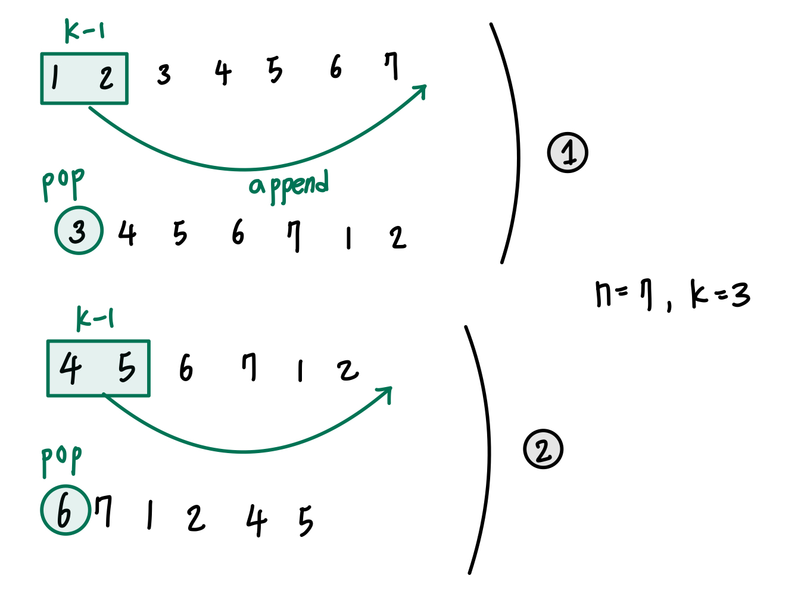

## 내가 푼 방법
⭐️ 방문 처리 및 반복문 ⭐️
- inital[] : 1~n 까지 순서대로 들어있는 숫자 리스트
- flag : 해당 숫자를 제거했는지 여부 파악
- answer[] : 제거한 숫자 순서대로 담는 리스트

        answer 리스트에 모든 숫자가 담길 때까지, 숫자 제거하기
        -> 제거한 숫자를 제외하고 k번째 있는 숫자이며, 해당 숫자를 아직 제거하지 않았다면 -> answer 리스트에 해당 숫자 담고, flag = 1 처리

## 다른 사람 풀이 
⭐️ 큐 이용하기 ⭐️

k-1개 빼놓고 다시 뒤에 붙이고, k번째를 pop 하기

+) 마지막 출력형태 : 리스트의 ('[')를 `.replace('[', '<')`로 간단하게 구현할 수 있다!

📌 **queue**를 문제에서 적절히 잘 활용하자

📌 출력 format에서 **.replace** 도 적절히 잘 활용하자
